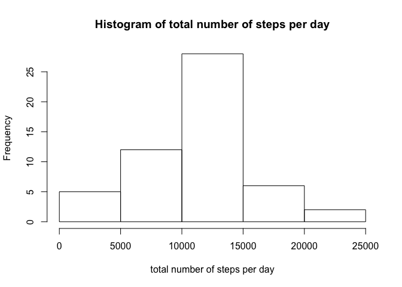
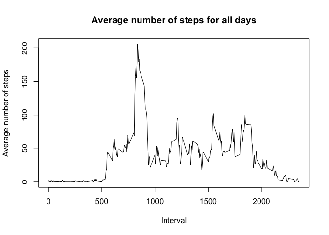
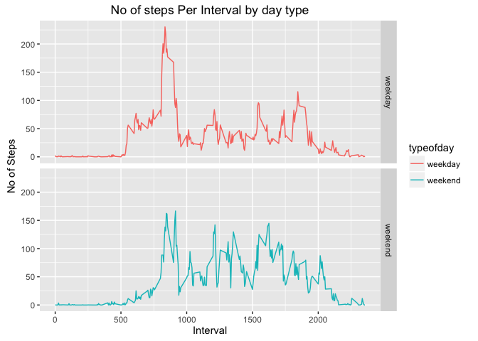

# Reproducible Research: Peer Assessment 1


## Loading and preprocessing the data
In this part of the Assignment, the data is loaded and formatted to a suitable, easy to work with, format.

```r
library(dplyr)
```

```
## 
## Attaching package: 'dplyr'
```

```
## The following objects are masked from 'package:stats':
## 
##     filter, lag
```

```
## The following objects are masked from 'package:base':
## 
##     intersect, setdiff, setequal, union
```

```r
library(lubridate)
```

```
## 
## Attaching package: 'lubridate'
```

```
## The following object is masked from 'package:base':
## 
##     date
```

```r
library(knitr)
library(ggplot2)

mydata_unfiltered <- read.csv("activity.csv", sep = ",")
mydata_unfiltered$date <- ymd(mydata_unfiltered$date)
mydata <- mydata_unfiltered[!is.na(mydata_unfiltered$steps), ]
head(mydata)
```

```
##     steps       date interval
## 289     0 2012-10-02        0
## 290     0 2012-10-02        5
## 291     0 2012-10-02       10
## 292     0 2012-10-02       15
## 293     0 2012-10-02       20
## 294     0 2012-10-02       25
```


## What is mean total number of steps taken per day?

Use the aggregate function to calculate the to the mean number of steps every day


```r
day_sum_data <- aggregate(as.numeric(mydata$steps), by= list(mydata$date), sum)
names(day_sum_data) <- c("date", "sum")
head(day_sum_data)
```

```
##         date   sum
## 1 2012-10-02   126
## 2 2012-10-03 11352
## 3 2012-10-04 12116
## 4 2012-10-05 13294
## 5 2012-10-06 15420
## 6 2012-10-07 11015
```

```r
hist(day_sum_data$sum, main="Histogram of total number of steps per day", xlab = "total number of steps per day")
```

<!-- -->

```r
summary(day_sum_data)
```

```
##       date                 sum       
##  Min.   :2012-10-02   Min.   :   41  
##  1st Qu.:2012-10-16   1st Qu.: 8841  
##  Median :2012-10-29   Median :10765  
##  Mean   :2012-10-30   Mean   :10766  
##  3rd Qu.:2012-11-16   3rd Qu.:13294  
##  Max.   :2012-11-29   Max.   :21194
```
## What is the average daily activity pattern?

```r
time_series_data <- aggregate(mydata$steps, by = list(mydata$interval), mean)
names(time_series_data) <- c("interval", "steps")
plot(time_series_data$interval, time_series_data$steps, type='l', 
     main="Average number of steps for all days", xlab="Interval", 
     ylab="Average number of steps")
```

<!-- -->

```r
maxrow <- which.max(time_series_data$steps)
time_series_data[maxrow,]
```

```
##     interval    steps
## 104      835 206.1698
```
The interval 835 has the maximum number of steps

## Imputing missing values

```r
length(mydata_unfiltered[is.na(mydata_unfiltered$steps),1])
```

```
## [1] 2304
```
**total number of NA`s is 2304.**

I am going to use the mean of the five minute intervals to replace the NA's.


```r
imputed_data <- mydata_unfiltered
for (i in 1:nrow(imputed_data)) {
  if (is.na(imputed_data$steps[i])) {
    interval_value <- imputed_data$interval[i]
    steps_value <- time_series_data[
      time_series_data$interval == interval_value,]
    imputed_data$steps[i] <- steps_value$steps
  }
}
```

**A new dataset with replaced NA values was created**
The head() of the daily sum of steps table is displayed below:

```r
##imputed daily average
da_imputed_data <- aggregate(imputed_data$steps, by = list(imputed_data$date), sum)
names(da_imputed_data) <- c("date", "steps")
head(da_imputed_data)
```

```
##         date    steps
## 1 2012-10-01 10766.19
## 2 2012-10-02   126.00
## 3 2012-10-03 11352.00
## 4 2012-10-04 12116.00
## 5 2012-10-05 13294.00
## 6 2012-10-06 15420.00
```

```r
hist(da_imputed_data$steps, main="Histogram of total number of steps per day (imputed)", 
     xlab="Total number of steps in a day")
```

<!-- -->

```r
## get mean and median of imputed data
mean(da_imputed_data$steps)
```

```
## [1] 10766.19
```

```r
median(da_imputed_data$steps)
```

```
## [1] 10766.19
```

```r
## get mean and median of data without NA's
mean(day_sum_data$sum)
```

```
## [1] 10766.19
```

```r
median(day_sum_data$sum)
```

```
## [1] 10765
```
**Mean values stays the same and median slightly deviates.**

## Are there differences in activity patterns between weekdays and weekends?


```r
#add weekday column
imputed_data["weekday"] <- weekdays(imputed_data$date)
imputed_data$weekday[imputed_data$weekday  %in% c("Saturday","Sunday")] <- "weekend"
imputed_data$weekday[imputed_data$weekday  != "weekend"] <- "weekday"

 #convert weekday column to factor variables
imputed_data$weekday <- as.factor(imputed_data$weekday)


##calculate average number of steps on weekdays and weekends
dimputed_by_interval <- aggregate(imputed_data$steps, by=list(imputed_data$interval, imputed_data$weekday), mean)
names(dimputed_by_interval)<-c("interval","typeofday", "steps")
head(dimputed_by_interval)
```

```
##   interval typeofday      steps
## 1        0   weekday 2.25115304
## 2        5   weekday 0.44528302
## 3       10   weekday 0.17316562
## 4       15   weekday 0.19790356
## 5       20   weekday 0.09895178
## 6       25   weekday 1.59035639
```

```r
# creat a plot
ggplot(dimputed_by_interval, aes(interval, steps)) +
    geom_line(stat = "identity", aes(colour = typeofday )) +
    theme_gray() +
    facet_grid(typeofday ~ ., scales="fixed", space="fixed") +
    labs(x="Interval", y=expression("No of Steps")) +
    ggtitle("No of steps Per Interval by day type")
```

<!-- -->


